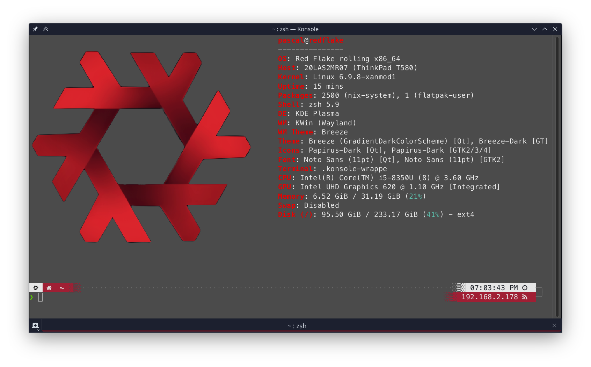
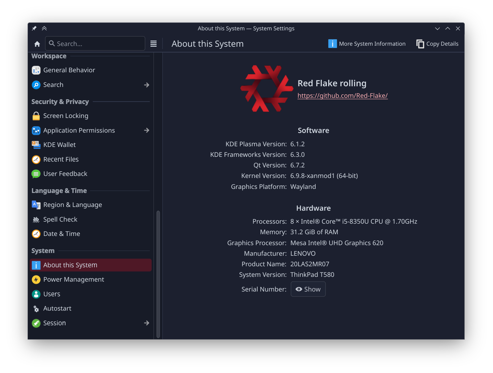
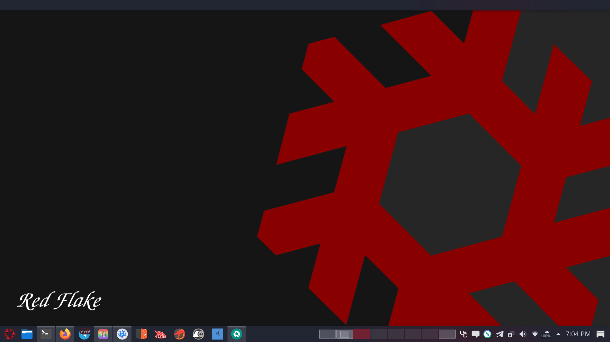

[](https://nixos.org)
&ensp;
[](#)
&ensp;
[](#)
&ensp;
[](#)

<br><br>

<h1 align="center">
    
   <br>
   Red-Flake Nix Flake
</h1>

<br><br><br>

# Installation

<br>

1. Bootup any NixOS live CD
2. Install Red Flake:
=> replace `/dev/sda` with your target root disk
```bash
FLAKE="github:Red-Flake/red-flake-nix#redflake"
DISK_DEVICE=/dev/sda
sudo nix \
    --extra-experimental-features 'flakes nix-command' \
    run github:nix-community/disko#disko-install -- \
    --flake "$FLAKE" \
    --write-efi-boot-entries \
    --disk main "$DISK_DEVICE"
```

<br><br>

# Showcase

<br>

## fastfetch



## KDE about this system



## KDE desktop



<br>

## KDE start menu


<br><br>

# Contributing

Community contributions are always welcome through GitHub Issues and
Pull Requests.

<br><br>

# License

Red-Flake is licensed under the [GPL License](LICENSE).
